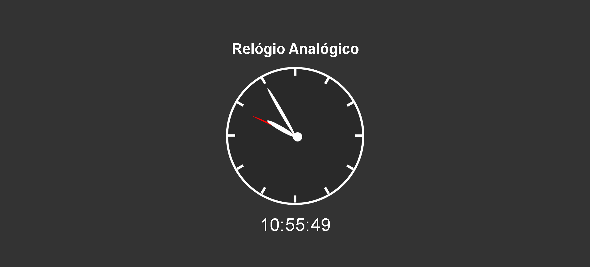

<h2 align="center"> 
  
</h2>

---
## Sobre
#### **Projeto Relógio:**  Olhando pro projeto você vê um relógio analógico e um digital. Nesse projeto a gente brinca um pouco com o transform, uma propriedade do css que da pra ser manipulada pelo JAVASCRIPT, assim conseguimos fazer o relógio Analógico.

 ---
GitHub Pages: https://aurelianoderafa.github.io/projetoRelogio/

 ---
## 💻 Tecnologia utilizada
 * HTML 5 
 * CSS 3
 * JAVASCRIPT